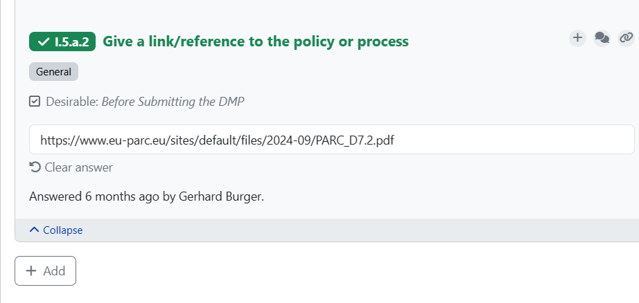
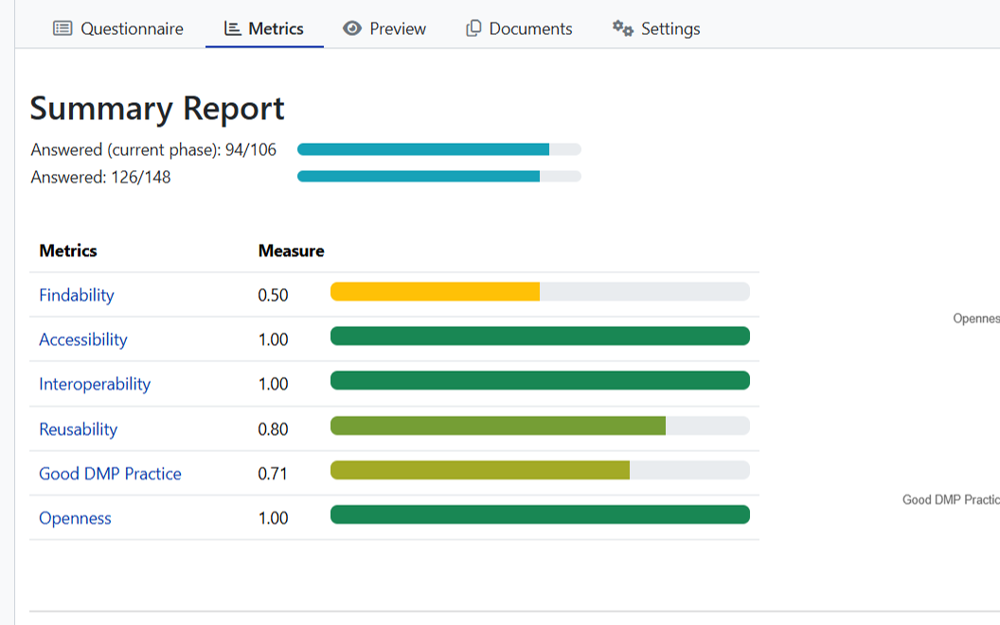

## Tips

1.  The questions in red/green coloured font are mandatory, the
    questions in grey coloured font are optional. Further, this is work
    still in progress, for the moment, you can ignore the completion of
    these optional questions if very confusing. Please get in touch with
    WP7 DMP team at
    [**wp7-dmp-troubleshooters@googlegroups.com**](mailto:wp7-dmp-troubleshooters@googlegroups.com)
    or Data Champions/ Data Liaisons if you want assistance.

2.  Filling optional questions will enrich the DMP. Example, the
    question: "Link to a project proposal or another description of the
    methods used in the project" can be left blank or free text inserted
    (even it returns an error message -- "This is not a valid URL!")

3.  To track DMP progress along the project^[At least three phases of DMP should be in all projects 1) before completing the DMP 2) before finishing the project 3) after finishing the project (and before finalising the report) which is the final update of the DMP confirming all datasets have been described.], create named versions
    (Figures 35 and 36) whenever phase is changed or significant updates
    have been made to the questionnaire. Create a new document (see
    figures 20 to 24) for how to create a new document, make sure to use
    an appropriate name reflecting the version, use the preferable
    download format (e.g. PDF/MS word) of the document to download the
    updated DMP document (related to the phase or version with
    significant updates).

4.  For the question on Affiliation: to get the name of the institution
    in the dropdown, full name of the institution might need to be
    typed.

5.  Response to the question: "To execute the DMP, is additional
    specialist expertise required?" should be a "yes" question as FAIR
    data and Data Management needs training and expertise.

6.  The "Add" button lets you include additional responses to a
    particular question. For example, in the screenshot (figure 40)
    below, additional policy and process documents links can be
    provided.

7.  The Manager and Deputy Manager can first fill the template with the
    knowledge they have about partners, institutional affiliation, etc.
    Researchers are needed to fill information regarding dataset
    generated/reused, equipment details, etc.

    {#fig-add-button-additional-responses}

8.  You can check the FAIR metrics of the DMP by clicking on the
    "Metrics" tab.

    {#fig-checking-progress-dmp}

9.  The DMP has seven chapters, the number next to the chapter indicates
    the number of **mandatory** questions that remain to be answered
    (this changes based on what answers you provide, for example, a "no"
    answer to a specific question, would reduce the number of mandatory
    questions, hence the number shouldn't be treated as final)

    I.  Administrative information

    II. Re-using data

    III. Creating and collecting data

    IV. Processing data

    V.  Interpreting data

    VI. Preserving data

    VII. Giving access to data

## Planned work in the knowledge model

1.  You may find, in some instances, dataset and database are written as
    "Data set", "Data base", "data-set" and cannot as "can not", and
    worldwide as "world-wide". These will be corrected.

2.  Some mandatory questions show as optional, these will be revisited.

3.  Idea is to create three domain specific project level templates
    (after the few planned hands-on sessions) -- toxicity, HBM,
    Environmental Monitoring -- that will be created from the general
    PARC project-level template, so that everyone uses domain project
    templates to create their DMPs.

## Project roles

The set of eight roles involved in the development of PARC Project-level
DMPs are shown below (integrated in the DMP tool).

1.  **Contact Person (for the DMP):** This is generally the person who
    had overall responsibility for developing the DMP, and as such has
    both technical knowledge and domain-specific knowledge. They are the
    person who can be contacted to acquire knowledge about the data
    resource or for acquisition of the resource

> Note: The DMP contact person and the contact person for project level
> data, i.e., the project leader (PL), can be same person in the case of
> PARC projects.

2.  **Editor**: Editor it is the person(s) responsible for having
    oversight of the publication of the DMP, editing/updating the DMP if
    the project manager delegates this responsibility, and for reviewing
    or updating the DMP (which includes WP7 or PARC Data Liaisons) on
    the behest of the Project Manager, etc.

3.  **Project Leader**: The named person(s) who conceptualised the
    project or activity, who was responsible for drafting the project
    description, and who is responsible for the successful project
    delivery.

> Note: In the case of some PARC projects, project leader and project
> manager / deputy manager could be the same person

4.  **Study Lead**: The person responsible for supervising/managing a
    sub-unit of a PARC-project.

5.  **PARC - Data Champion**: The role of Data Champion can partially
    overlap with the role description of Data Manager (see definition
    above for Data Manager) in the context of making PARC data FAIR. The
    Data Champion is appointed by each project or activity within the
    various work packages of PARC to "champion" the need for proactive
    data management and feeds issues that arise in the data management
    effort back to WP7. The role involves undertaking the (i) data
    management activities to annotate (produce metadata), review or
    enhance metadata, (ii) checking whether the submitted dataset is
    complete, with all files and components as described by submitter,
    and (iii) maintaining research data (including software code, where
    this is necessary for interpreting the data itself) for initial use
    and later re-use.

FAIR data champions are scientific experts who are proponents for FAIR
data. The Champions can work as FAIR ambassadors, sharing FAIR
implementation stories, enhancing synergies, and contributing to
training activities and webinars.

6.  **PARC - Data Liaison:** Data Liaisons from within WP7 have
    overarching data management knowledge (and receive additional
    training) and preferably domain specific knowledge that are
    appointed to "support" the PARC projects and Data Champions in
    developing their data management plans. The Data Liaisons are
    responsible for co-creating metadata schemas and harmonised
    templates for metadata reporting and providing support to the
    investigators, as needed for the specific project.

7.  **Project Manager:** The person with administrative responsibility
    for planning, managing, and monitoring progress within available
    resources while adhering to project commitments, and resolving
    issues arising in a project, but typically not directly involved in
    the research or research data lifecycle.

8.  **Data Protection Officer**: The tasks description of a DPO is per
    Article 39 of General Data Protection Regulation (GDPR). One example
    of important tasks is outlined in
    <https://gdpr-info.eu/art-39-gdpr/>. DPO is especially important for
    PARC WP4, where most of the Human Biomonitoring activities are
    housed.