# Create a DMP project

## Creating a project-DMP from a Project Template (Method 1)

1.  **Decide first within your project who would be responsible for
    creating the project DMP in the DSW.** Select Projects from the
    Dashboard (both marked as red boxes on left hand side in Figure 4)
    and select "Create" button.

    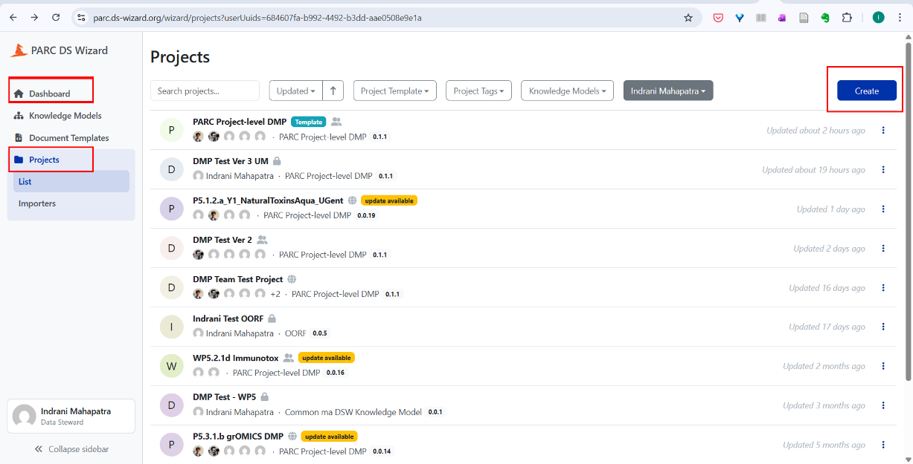{#fig-screenshot-create-project-from-template}

2.  The screen shown in Figure 5 appears, select "from project template"
    tab.

    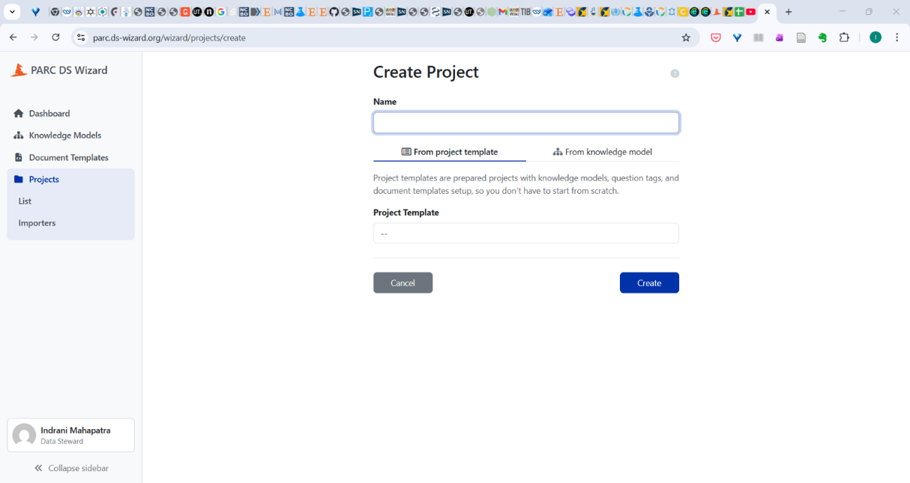{#fig-from-project-template}

3.  From the dropdown, select "PARC project-level DMP". This selects the
    default "PARC Project-level DMP template" as starting point for
    creating a project.

    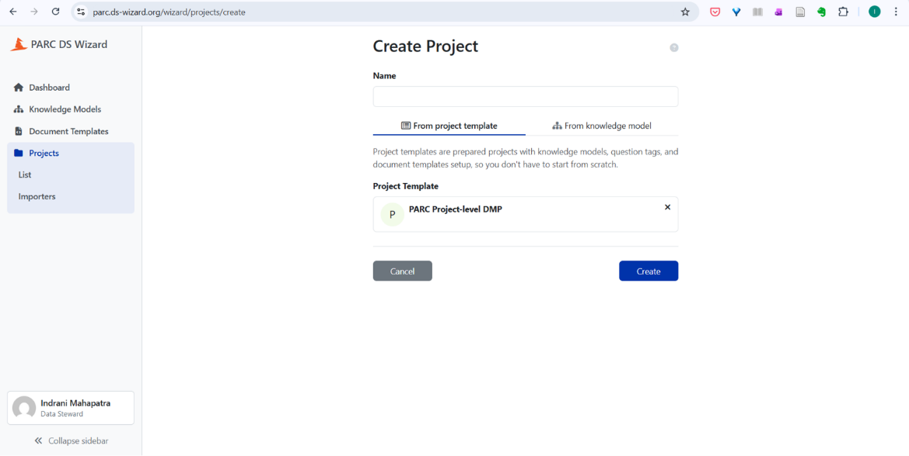{#fig-selection-of-parc-project-level-dmp}

4.  Provide the name of the project (preferably project ID) and select
    the blue button "Create".

    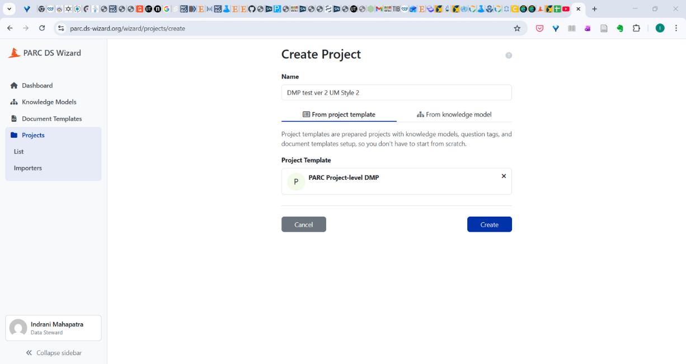{#fig-name-field-project-id}

For next steps, go to page 11, point 5.

## Creating a project-DMP from a Project Template (Method 2)

1.  Clear selection (see the text within the red bordered circle below)
    next to your name (you will find the various Projects related to
    DMP).

    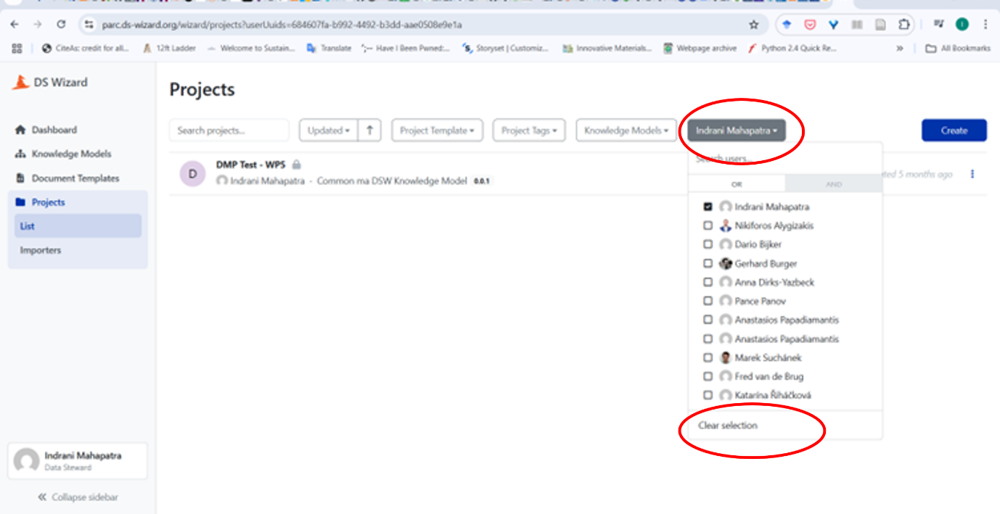{#fig-clear-selection-view-projects}

2.  You can search the PARC Project-level DMP template by using the
    "search projects" box and using the term "PARC Project-level DMP".
    See the boxes with red coloured borders in Figure 9.

    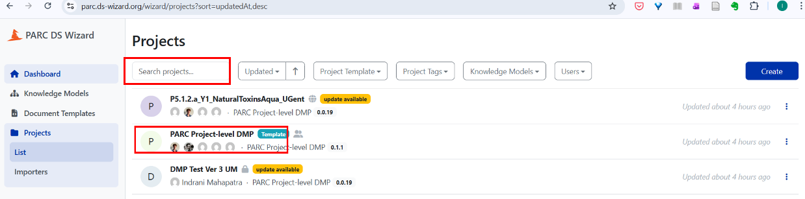{#fig-key-aspects}

3.  Click on the three dots next to the PARC project-level DMP. Then
    select "Create project from the template". **Please note that
    project teams should together make one instance of one project
    specific DMP per PARC project.** **The project personnel/researchers
    who are responsible (as per roles provided in the Appendix) for
    creating, filling, and editing the DMP should create the instance**.

    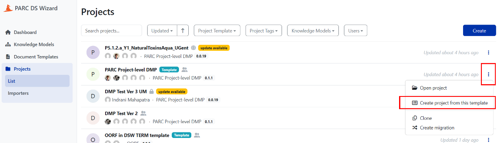{#fig-create-parc-project-level-dmp-from-template}

4.  After clicking the "Create project from the template" button, you
    will get the screen as shown in Figure 11. Give a name to your
    Project-DMP using the project ID (e.g., P7.2.2a_Y1_Environment) and
    click the blue "Create" button.

    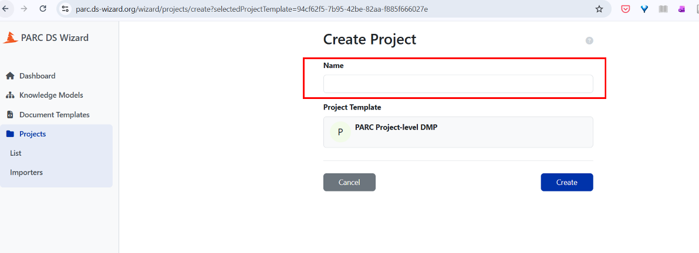{#fig-parc-project-id-name-field}

5.  You will see the screen as shown in Figure 12.

    {#fig-questions}

6.  Use the **Share** button to share the DMP draft with project members
    from your project, Data Champions/ Data Liaisons, who have
    registered to the DSW wizard and who can help you fill in the
    details. **Please ensure that you have all relevant members (only
    select a small group of owners) of your project to sign up and agree
    upon [one common DSW/DMP instance for your Project]{.underline}.**

    > Also, share with WP7, **findable with the username "WP7 DMP
    > Troubleshooters"** to have your comments visible to WP7 members.

    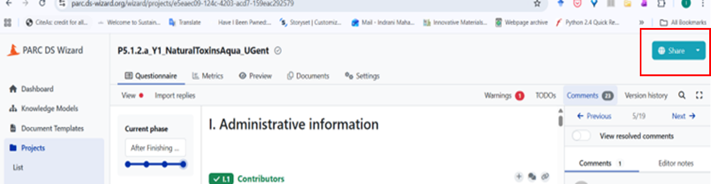{#fig-share-dmp}

7.  After clicking the "Share" button, start adding users based on the
    Roles defined in Appendix. In Figure 14, when the first few letters
    of a person's name are put in the "Users" field, we get a drop down
    and you can select that person to add as a user. **Please make sure
    that the person you want to add as a user has signed up to the DSW,
    otherwise, their name won't appear. Within one PARC project,
    different datasets may be created by different PARC partners
    simultaneously and the person who is taking up the role of DMP's
    contact person would have the responsibility to collect the details
    of these datasets to be included in the DMP.**

    ![If you want to make the Project‑DMP visible to others who are logged‑in the DSW, toggle (slide) the button (where it mentions "visible by all other logged‑in users") to the right. You can choose to make the DMP available as a public link (use the toggle to make the decision). Choose the option "view" (neither comment nor edit) for both logged in users and public link as you would not like anyone with the link to edit or comment. Please note that at the project completion, all DMP links will be public.](images/guide/image18.png){#fig-make-project-dmp-visible}

8.  After adding users for sharing purposes, give them user rights --
    owner, viewer, editor, commenter (See Figure 16) . You may give
    project team members the right to comment or edit. If your project
    has a deputy project manager, make them also an owner. You can add
    the WP7 Data Liaison as an Editor. However, if you want to be able
    to directly tag WP7 members to comments/aspects (see Figure 14) with
    which you might need help, make "WP7 DMP Troubleshooters" as
    "owners".

    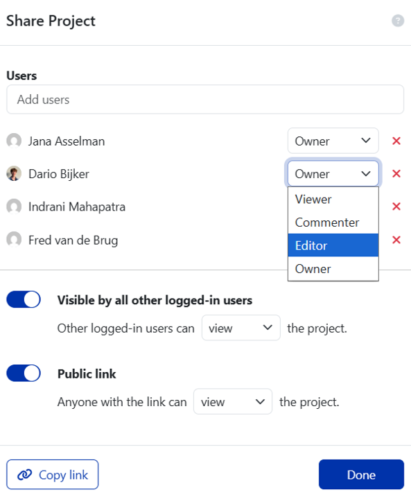{#fig-available-user-rights}.

    The access conditions^[From: <https://guide.fair-wizard.com/en/production/applications/data-management-planner/projects/list/detail/sharing.html>] related to different user-right categories are
    provided in Figure 12.

    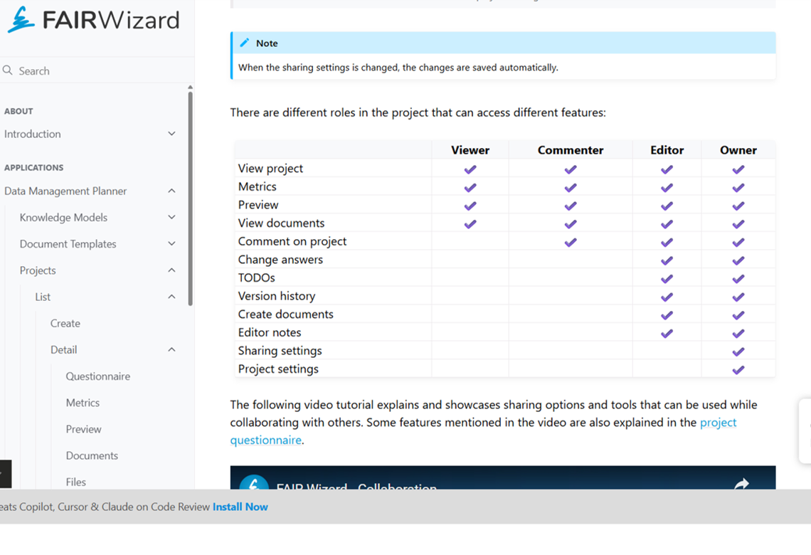{#fig-user-rights-access-project-level-dmp}

9.  Please select the DMP development phase from the drop-down menu.

    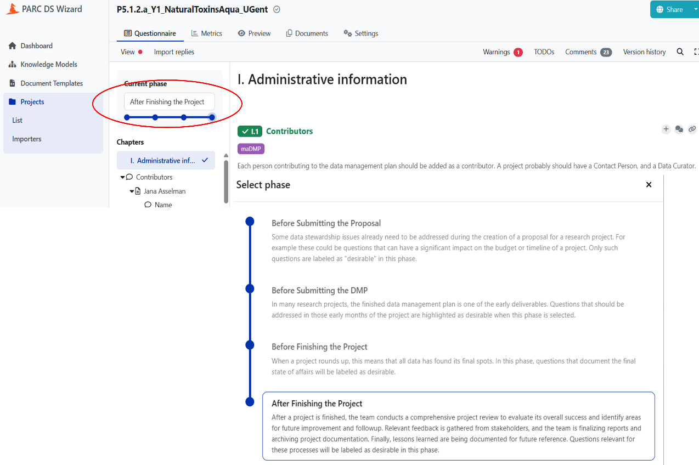{#fig-four-phases-wizard}

10. You can add comments (see red bordered circle at the top right in
    Figure 14) for project members and then assign them (see the person
    emoticon within the second red bordered circle at the right in
    Figure 14) to check/review the answers. **This is possible only if
    they are made "owners" or "editors"**. Please search "WP7 DMP
    Troubleshooters" while assigning to the WP7 DMP team. You can
    contact WP7 team via email :
    [[wp7-dmp-troubleshooters@googlegroups.com]{.underline}](mailto:wp7-dmp-troubleshooters@googlegroups.com)
    if you need help/ any question isn't clear to you. Short meetings
    with WP7 can also be planned, if needed.

    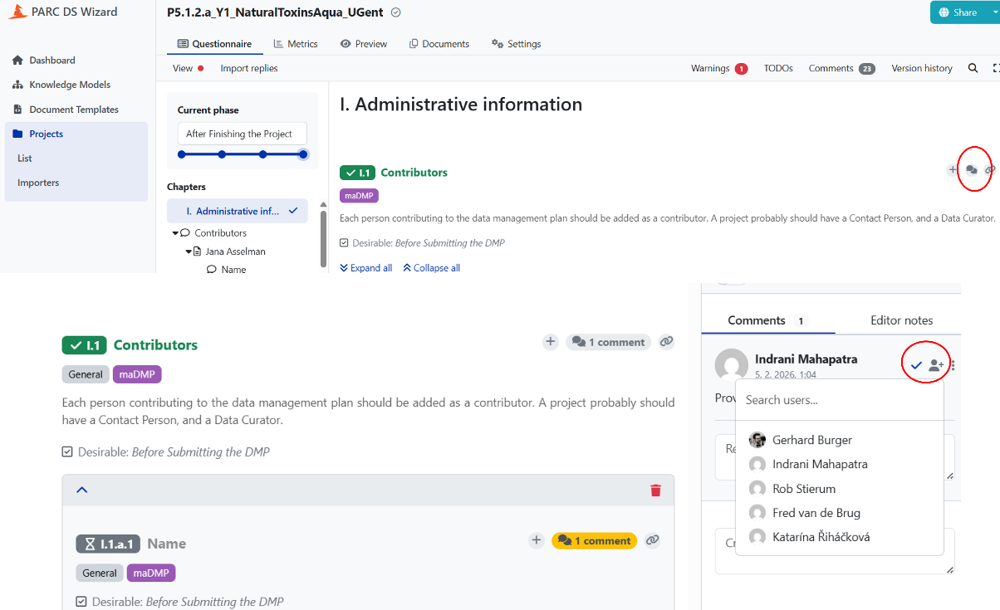{#fig-add-comments-assign-wp7}

11. Clicking on the plus sign, to the left of the comment sign, will
    give you a **TODO** which helps you to keep a note of things you
    need to attend to/come back to.

    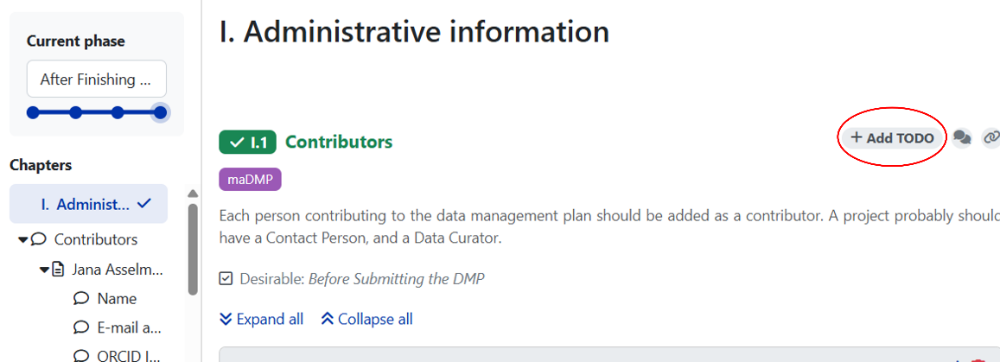{#fig-add-todo-button}

12. In order to keep track of your DMP at different stages of completion
    (see Tip 3), you can export your DMP in various formats (PDF, MS
    word, HTML) and export these to your own environment. Suppose
    projects update the DMP every six months (we are suggesting this as
    a good practice), a static snapshot of the updated work is saved as
    a new document (document tab, create new document, see Figures 20
    and 21) and download/export the filled questionnaire in PDF/Word.
    These saved documents will show the progress over time and help in
    PARC KPIs.

    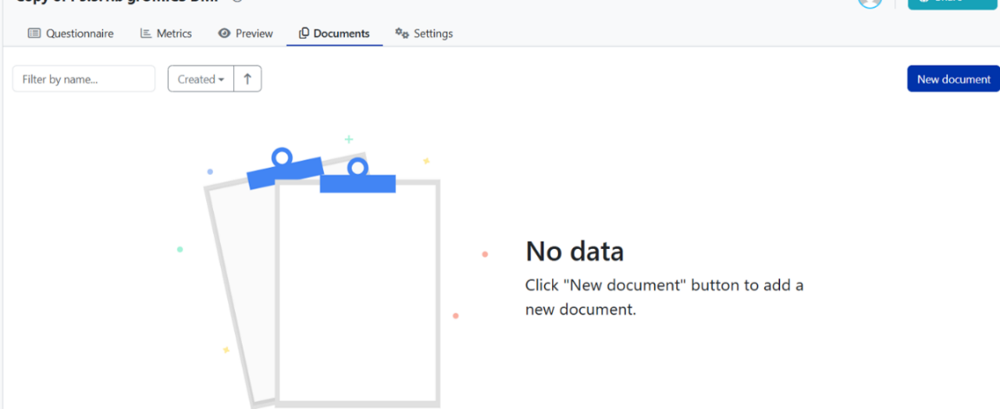{#fig-snapshot-document-tab}

    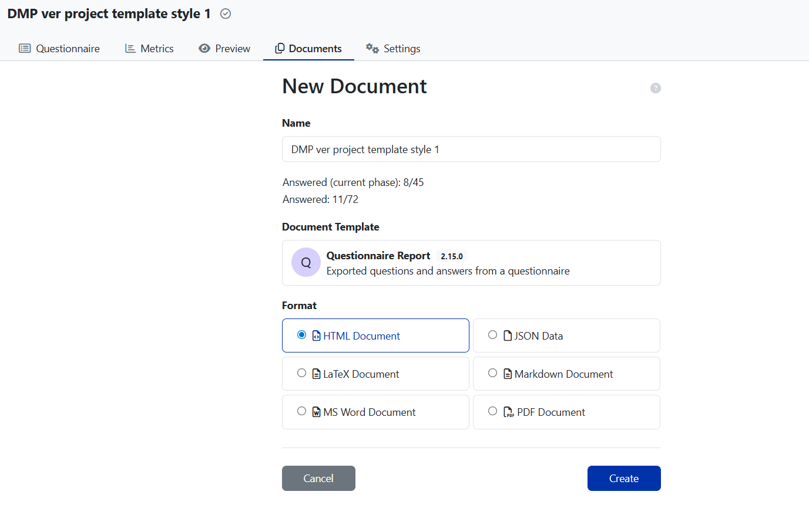{#fig-screenshot-fields-document-name-template-format}

13. When you select the Document Template, you can see the DMP
    questionnaire version to be used for exporting the questions. Select
    the latest questionnaire version (in Figure 22, it is 2.16.0)

    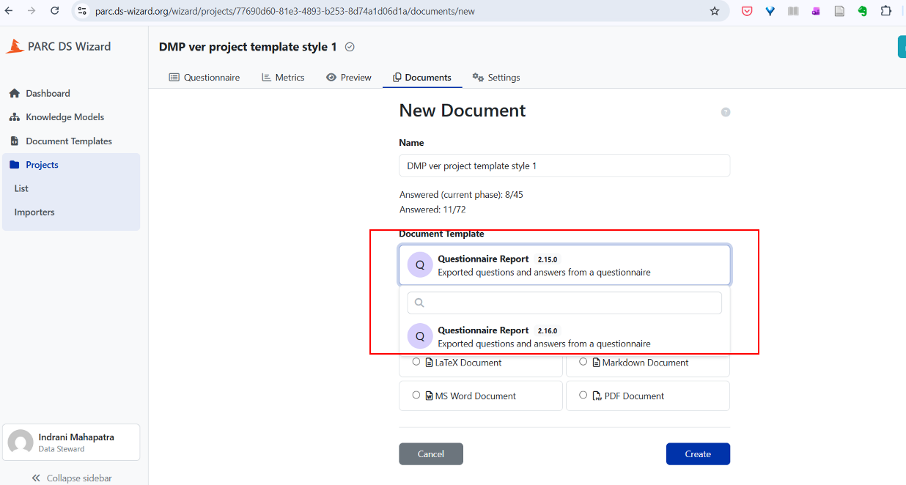{#fig-export-filled-questionnaire}

14. After selecting the right questionnaire version, selecting the
    Document Format (see Figure 21, where Format is a section), and
    giving the document an appropriate name, hit "create" you will get
    the screen as shown in Figure 23.

    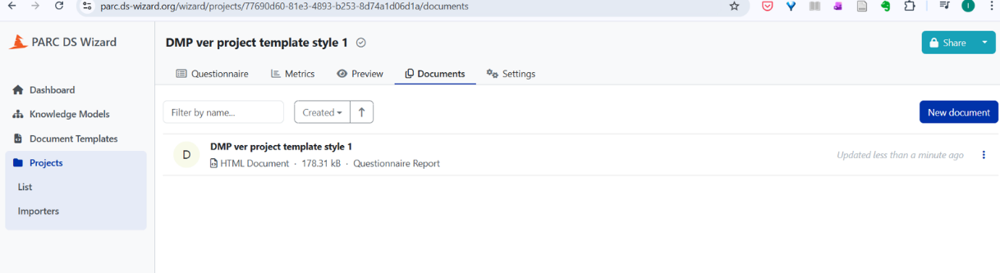{#fig-screenshot-document-created-saves-version}
