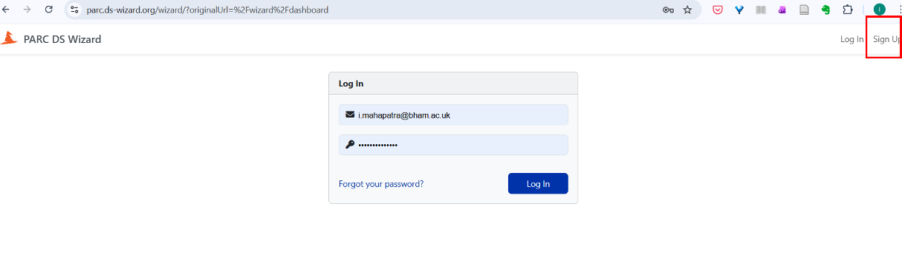
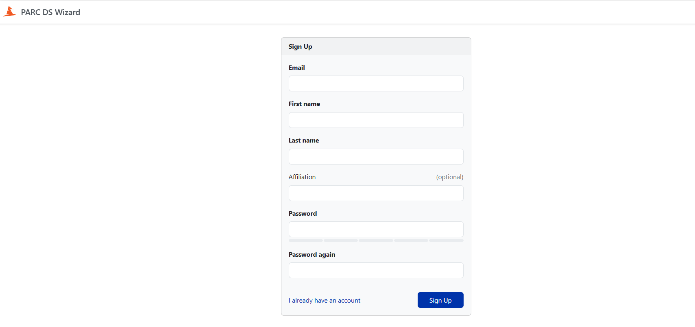
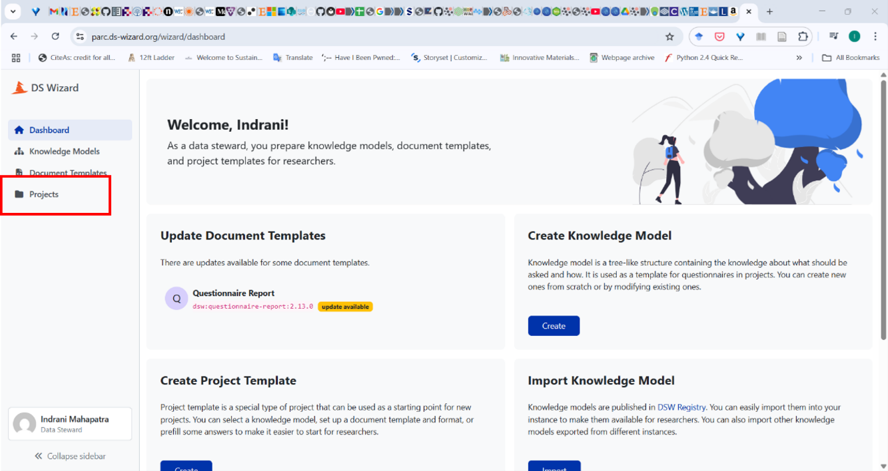

## Registering to the DS Wizard

1.  Use the link <https://parc.ds-wizard.org/> to register/sign up.

    {#fig-creating-an-account-in-the-parc-ds-wizard-platform}

2.  
    ::: {.callout-note}
    We suggest that projects discuss and agree on their roles (please
    refer to the Appendix for roles related to DMP activities) for the
    specific project as defined for the DMP. Also, decide who would be
    responsible for creating the project DMP in the DSW. 
    :::

    One project member should  create the DMP project in the DSW and then 
    "share" (see point 6) it with other project members who
    would be contributing to the DMP in various capacities. After you
    have included relevant details (e.g., your email id) to complete the
    registration, you will get the activation link sent to the email id
    used for the sign up.

    {#fig-sign-up-screenshot-in-the-dsw}

3.  When you click the activation link, you will reach the home screen;
    click on "Projects".

    {#fig-dashboard-in-the-parc-dsw-wizard-tool}
