# Miscellaneous 

## Updating project DMPs based on a new Knowledge Model version

A knowledge model is the single underlying model for a DMP where all
questions and explanations are maintained. It allows the possibility to
update a DMP to the newest version of the knowledge model if any
questions are added/modified/deleted. It also allows to derive domain
specific DMP model which can be used as a template by projects for their
DMP.

1.  When available, select the Yellow colour pill shaped box "update
    available" next to your project.

    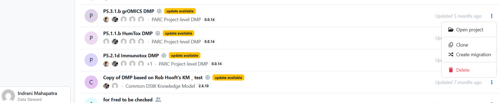{#fig-updates-available-km}

2.  You will get a screen as shown in Figure 25.

    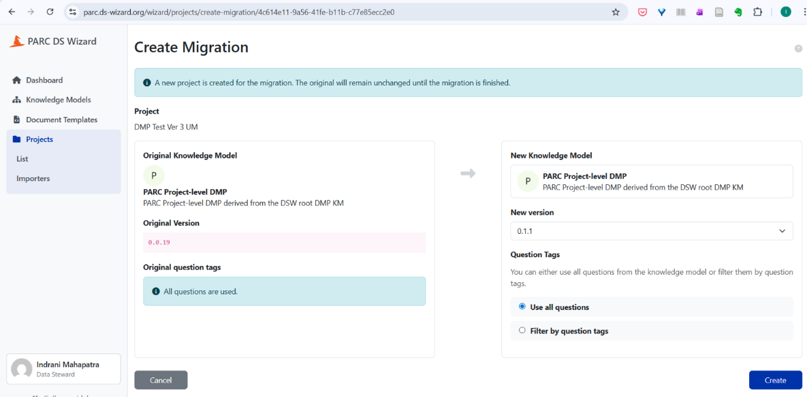{#fig-updating-dsw-knowledge-model}

3.  Though the latest version under the heading "new knowledge model"
    appears automatically, you can check if the knowledge model is of
    the latest version. See screenshot in Figure 26. Select the "Create"
    button (blue coloured box).

    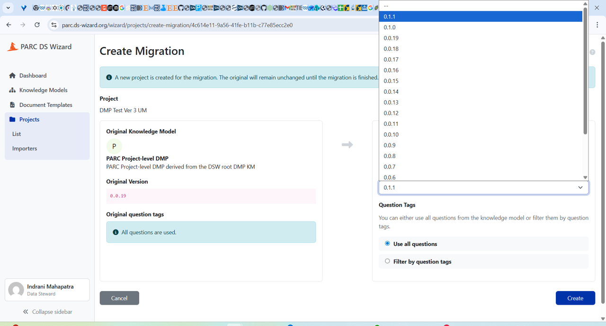{#fig-knowledge-model-versions}

4.  Select "resolve all" (you can check the changes that would be made
    in the updated questionnaire.

    ![In this Figure, the differences between the Source (existing) DSW Knowledge model and the Target (New) DSW Knowledge model are shown, within an existing DMP ("DMP Test Ver 3 UM", with different colours. Ideally, the project specific DMP has been (partially or wholly) completed with the existing Knowledge Model/Questionnaire to meet timely FAIRness of PARC data. Should domain specific changes in the KM (the content for the DMP questionnaire) have appeared in the meantime, then an update of an existing Project DMP can be easily made by "resolving all" and adding any new answers to the questionnaire. This is done by selection of "Resolve all" -- the box at the top right corner, to accept all. Followed by migration (Figure 28)](images/guide/image31.png){#fig-differences-source-target-knowledge-model}

5.  Click "Finalize migration" (red border box, at the top right corner)
    to complete the updation process.

    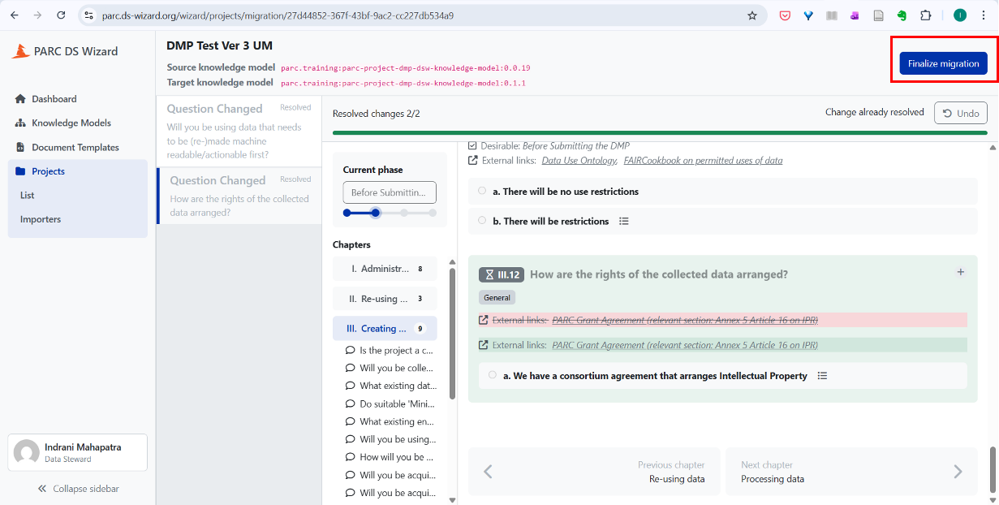{#fig-finalise-migration-button}

## Cloning your project to create DMP for a similar, yet new project

This section is **ONLY** for those projects which have got new funding,
new project IDs, but are in some way closely related to a previous
project.

1.  You can search your project in the "search projects" box by using
    the name of the project or try to find the project which you want to
    create a copy of under your username (tab "users").

    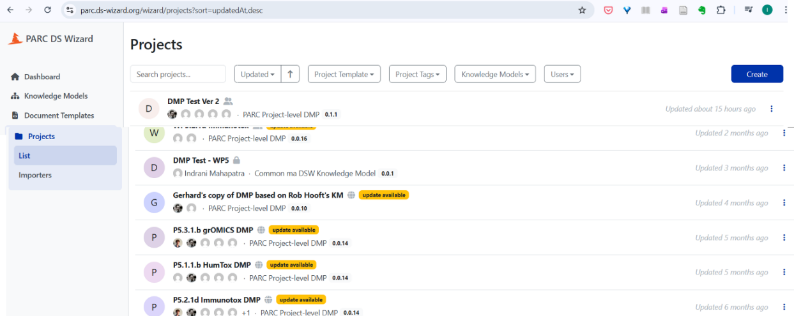{#fig-search-projects-box}

2.  Click on the three dots next to the project whose template you want
    to use for your DMP. Select the "Clone" button to create a copy of
    the project DMP

    {#fig-options-next-three-dots}

3.  After clicking the clone tab from the drop-down menu, you will get
    the screen shown in Figure 31 to confirm whether you want to create
    a copy of the project. Click the blue coloured button "Clone" to
    make a clone of an already existing project for reuse

    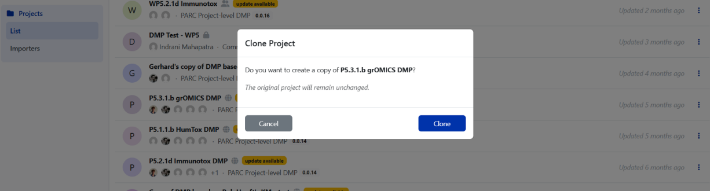{#fig-clone-button}

4.  Give an appropriate name of the project in the "Settings" tab,
    update the questionnaire template (in Figure 33, pink coloured box
    shows there is a new template available). Also, scroll down the
    screen to check whether the knowledge model is updated (not shown in
    Figure here). Please note: New templates/ templates being
    incompatible (can be seen in pink coloured box) will also happen to
    projects that are not cloned.

    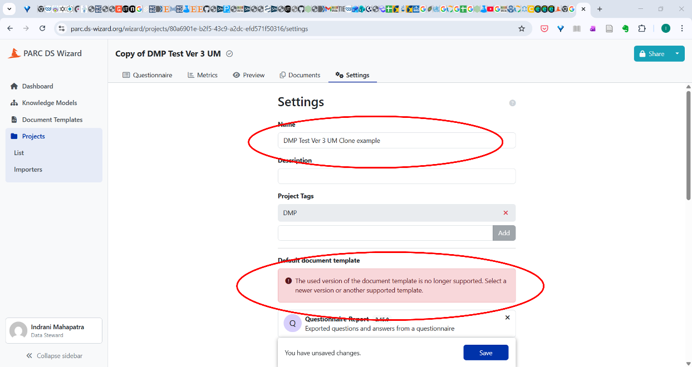{#fig-settings-provide-project-name}

5.  Select the HTML document and click "Save".

    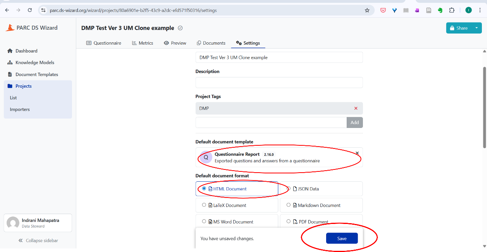{#fig-saving-cloned-project-new-name}

## Selecting DMP phases as the project progresses

Refer Figure 17 for the phases of project. You can change the phase of
the project (see Figure 34). Only by changing the phase will the
questions related to the next phase appear. When you are starting to
create the DMP **for the first time for an ongoing project** use the
phase "Before Submitting the DMP".

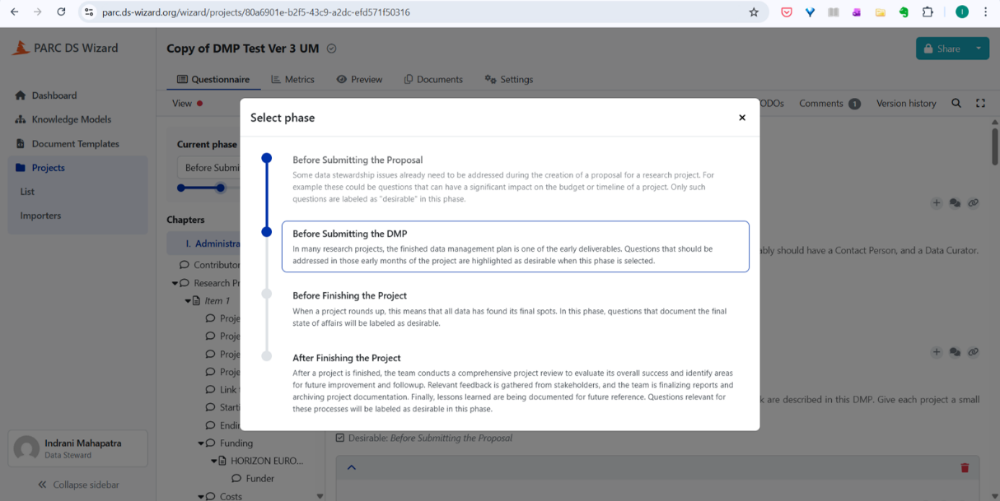{#fig-project-phases-selecting-phase}

You can name the version of the DMP when you are updating (good practice
is every six months, can be done more frequently) the DMP in the DSW.

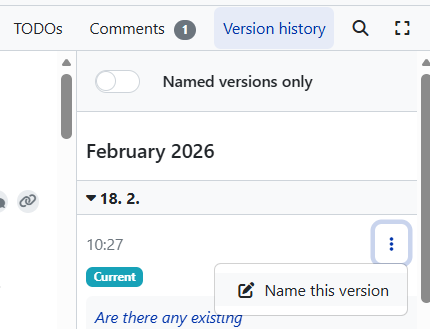{#fig-named-version-dmp}

Click on the three dots (shown in Figure 35) and provide a suitable name
for the version and description (see Figure 36). If no name is given to
the version, you can track changes made based on the default date
template.

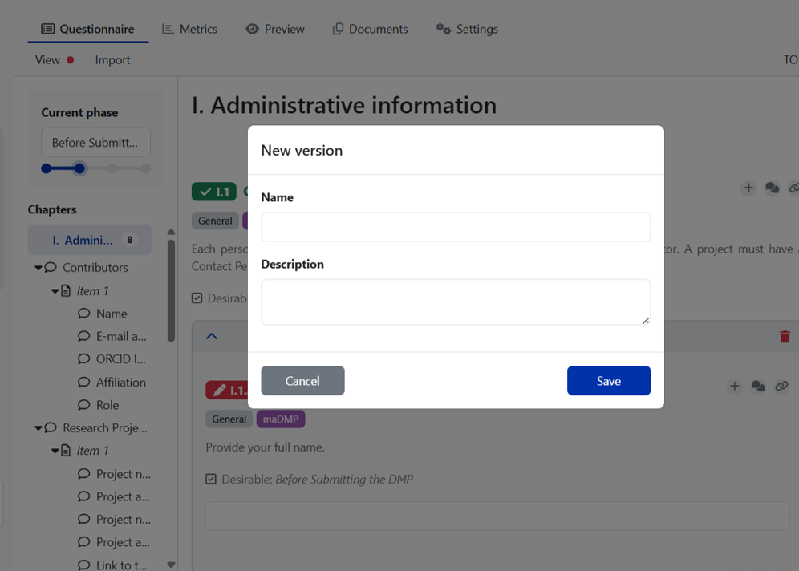{#fig-three-dots-date-screen}

When you toggle on the "Named version only" tab (see Figure 35), you
will see only those DMP versions which you have given a name to, thus
reducing the view of the versions which get recorded automatically as
per the date when you worked on the DMP.

## To download the DMP in PDF, MS word, and other formats

The document formats help you download the document in various formats,
such as JSON, LaTeX. Default is HTML for "Preview" purposes which helps
to track the responses. See Figure 37.

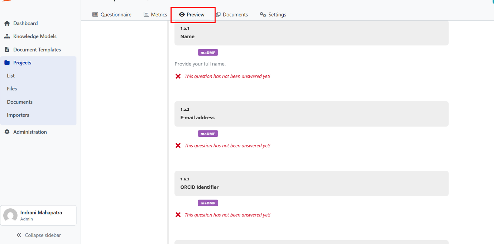{#fig-preview-tab-saved-html}

Click on "Documents" tab, select the "new document", give the document
an appropriate name (reflecting the phase of the DMP), select PDF
document or MS word document, select the updated version of the
questionnaire report, and then select "Create".

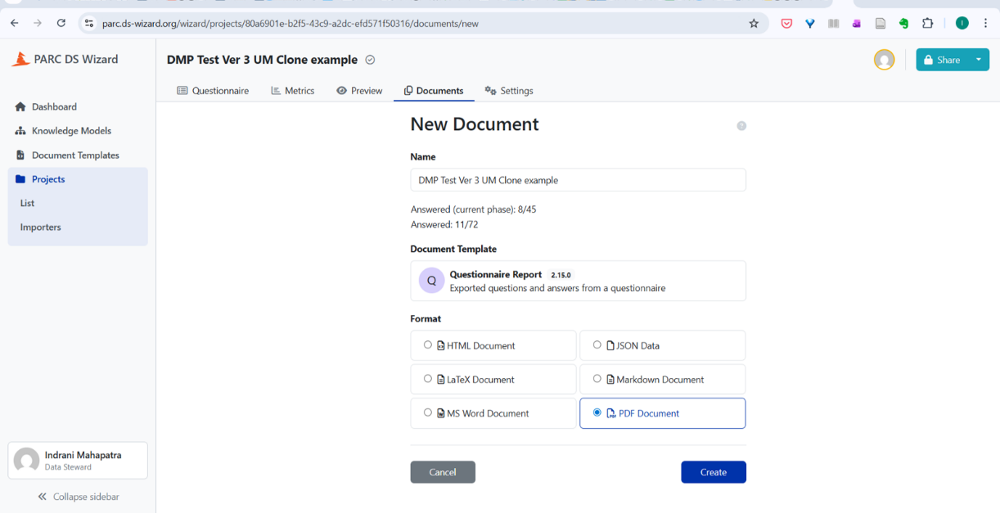{#fig-document-tab-pdf-format}

You will see the screen which creates the PDF report, hover your cursor
on the file name, a black shaped box mentioning "click to download the
document", by clicking on the link, the DMP can be downloaded and saved
on your computer.

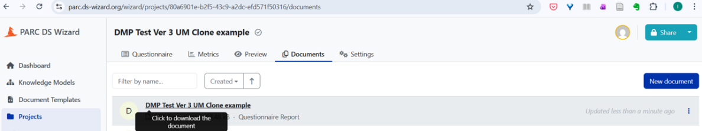{#fig-hover-cursor-click-download}

